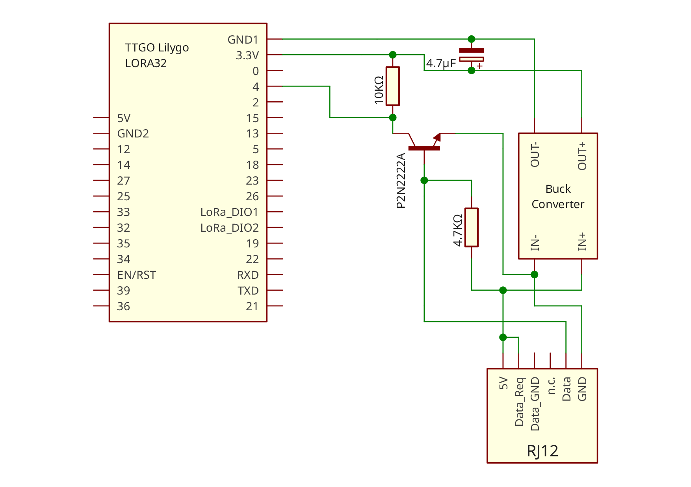
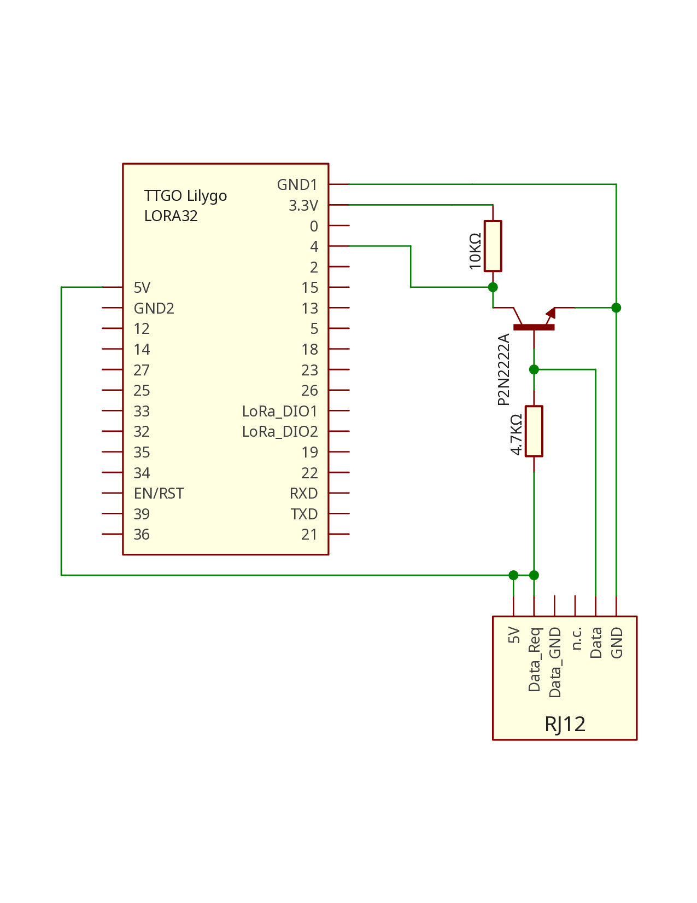

# ESP-SmartMeter-Reader
This project aims to read data from a smart meter and publish it to an MQTT server. The smart meter must comply with the DSMR 5.0.2 P1 Companion Standard.

In this specific use case, the smart meter is located out of Wi-Fi range and no additional power source is available. Therefore, the ESP32 is powered directly through the P1 port, which provides up to 5V at 250mA. The meter data is transmitted via LoRaWAN to another ESP32, which receives, decrypts, parses the data, and then publishes it to a local MQTT broker.


## Verified meter hardware / supplier
* Sagemcom T210-D-r (From energie netze Steiermark in Austria)


# Hardware


## Parts
* 2 ESP32 LILYGO TTGO Lora V2.0 (These were already available for me and can by replaced by a esp32 and Lora Module or a newer version of the LILYGO TTGO Lora)
* 1 P2N2222A NPN transistor
* 1 4.7kOhm Resistor
* 1 10kOhm Resistor
* 1 DC-DC Buck-Converter (not required)
* 1 CD110 50V 4.7µF Capacitor (not required)
* 1 RJ12 cable (6 wires) or 1 RJ12 6P6C port and RJ12 to RJ12 cable


## Wiring

The Data Request line has to be pulled high to 5V letting the smartmeter know that Data can be transmitted now. The Data line sends out the signal inverted hence the transistor is needed which intern also converts the signal from 5V to 3.3V. it is also possible to use the RX pin of the ESP directly but then it is no longer possible to flash the ESP32. Therefor we connect it to GPIO pin 4 and set it to Hardware Serial 2.  

### Wiring with Buck-Converter



### Wiring without Buck-Converter



# Data parsing
## Raw data

The Smartmeter sends data every 10 seconds. The data can contain up to 1024 bytes. Below an example with 511 bytes.

```
DB 08 53 41 47 35 00 06 6C 0E 82 01 F2 30 00 00 01 74 50 EB D5 E3
53 E3 D6 78 A0 C7 8A 34 86 D3 CC A1 36 32 0E D2 9C 57 74 41 B9 D8
CA 33 6F 39 B9 5F 67 63 05 22 DA 9C AB C6 6E 22 85 0D 29 14 A1 94
46 3C 26 47 1D 3C 81 F9 93 FD CC BA 07 D4 C1 5A C1 3D 42 6A FE 8B
7C 17 2D C1 6E 1B 6A 4D CE F1 80 E5 1A 32 A6 9A B4 3B F6 07 30 E6
C0 AB 2E 75 B9 CB 62 E8 68 A7 BE F7 BD B0 06 5C BE A9 53 8E 1D 2F
11 F5 DE 6A AF 6E 68 C8 21 D4 47 76 8B CA 2A 9E D2 10 C1 34 6F AD
82 08 5A B9 65 65 6A E7 D2 1D FE 80 7C CF CA B9 E9 45 00 04 74 ED
78 56 B2 AC AC A1 66 64 9D E3 65 EE B3 56 F2 A9 EF F7 4B EA 7C 20
2C 13 0C 30 3A 24 BD 21 FD 1B F9 64 51 BD 56 50 97 62 24 63 B4 64
A0 FF 20 8D 80 CB 23 27 1E DB 71 1A 2A EC F5 A2 1A 52 27 A9 7D E5
DC 55 37 9B A8 6E 11 C1 7D 75 2B CB 1E 45 7F 5A 36 C2 B0 62 52 67
67 45 55 49 58 5F C2 1B 96 BE C9 4E 89 11 11 5C 7A F1 D3 76 CC 2A
B3 E2 98 34 CC CF BB 4E D2 39 E3 FB BB 34 34 73 23 D4 00 63 00 96
0A 53 FD EA 60 B7 D2 B5 56 DF E0 57 D8 7D 94 CC EE 33 CD 06 51 9E
0D 8F F0 F9 5F DB 68 DE 58 E3 AE 0A 81 30 8A C0 A8 0B 50 6E 4F B2
3D 96 6B 10 FC 58 7B 0D ED D6 FD 77 CE F9 2A 8C 99 2E AD EC 1F 3E
87 4E 09 B5 6C A1 C3 59 F0 7C F2 9A BF 38 9A 6E E0 18 B6 2E 8B 4B
05 51 44 06 D6 D8 F7 8C DB 3D 3A 17 1F 54 97 B4 EE 94 1D 39 F0 C7
DA DE 71 CC 1E D4 F3 77 E7 8F 4F EF 54 2D 51 EC 33 98 AD C8 48 E0
B3 A0 69 96 FE 3D 33 2F B0 39 60 3F 00 79 62 46 98 90 D8 8E 03 AE
55 64 EE 84 54 1A 84 7F A1 DB B7 04 56 2B E2 77 CE 01 4D F3 B5 43
20 0D F9 57 49 AA 73 03 A9 60 43 62 BA 46 EC FE 97 BE 5F 0B B3 76
10 20 36 80 BC
```

* Start byte: ```0xDB``` (1 byte always ```0xDB```)
* System title length: ```0x08``` (1 byte should always be ```0x08```)
* System title: ```0x5341473500066C0E``` (given length of 8 bytes)
* Separator byte: ```0x82``` (1 byte should always be ```0x82```)
* Length of subsequent bytes: ```0x01F2``` (2 bytes can be used to check if all data has arrived)
* Separator byte: ```0x30``` (1 byte should always be ```0x30```)
* Frame counter: ```0x00000174``` (4 bytes)
* Cipher text: ... (481 bytes)
* GCM tag: ```0xFE97BE5F0BB37610203680BC``` (12 bytes)

## Decrypting the data

The data is encrypted using AES-GCM with the following parameters:
* Encryption Key is the provided Global Unicast Encryption Key (GUEK) from the energy provider
* Initialisation vector (IV) = ```System title``` + ```Frame counter```
* Additional authentication data (ADD) = TBD
* Authentication tag = ```GCM tag``` (Last 12 bytes of frame)


# Technical documentation

* DSMR 5.0.2 P1 Companion Standard [https://www.netbeheernederland.nl/publicatie/dsmr-502-p1-companion-standard](https://www.netbeheernederland.nl/publicatie/dsmr-502-p1-companion-standard)
* Specification of the Energie Netzte Steiermark in German [https://www.e-netze.at/downloads-data/pdf.aspx?pdf=EN_Update%20Kundenschnittstelle%20Smart%20Meter%20(03_2024)_WEB_RGB.pdf](https://www.e-netze.at/downloads-data/pdf.aspx?pdf=EN_Update%20Kundenschnittstelle%20Smart%20Meter%20(03_2024)_WEB_RGB.pdf)
* ESP32 Lora Device [https://meshtastic.org/docs/hardware/devices/lilygo/lora/?t-lora=v2.0#features-2](https://meshtastic.org/docs/hardware/devices/lilygo/lora/?t-lora=v2.0#features-2)

## Other SmartMeter Reader Projects

* [https://github.com/schopenhauer/sage?tab=readme-ov-file](https://github.com/schopenhauer/sage?tab=readme-ov-file)
* [https://github.com/lvzon/dsmr-p1-parser](https://github.com/lvzon/dsmr-p1-parser)
* [https://github.com/metrophos/LoxBerry-Plugin-P1-Decrypter](https://github.com/metrophos/LoxBerry-Plugin-P1-Decrypter)
* [https://github.com/psvanstrom/esphome-p1reader/tree/main](https://github.com/psvanstrom/esphome-p1reader/tree/main)
* [https://tasmota.github.io/docs/P1-Smart-Meter/#schematics](https://tasmota.github.io/docs/P1-Smart-Meter/#schematics)


